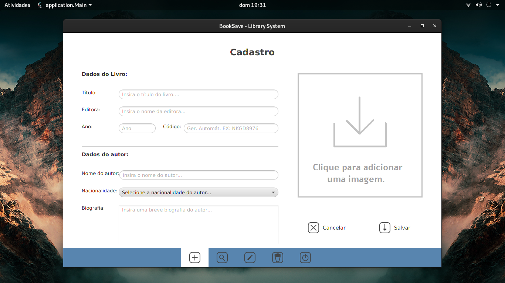
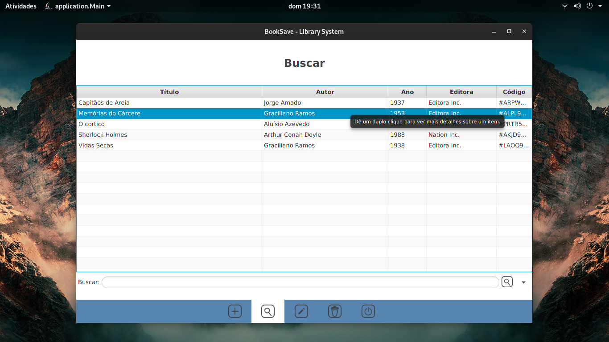
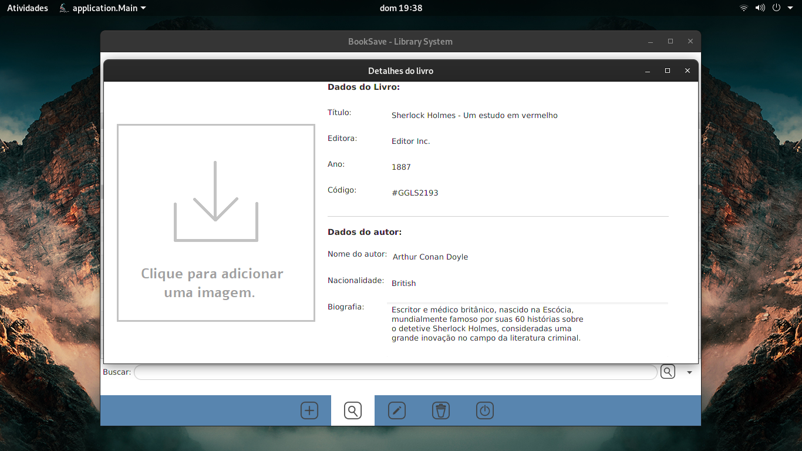
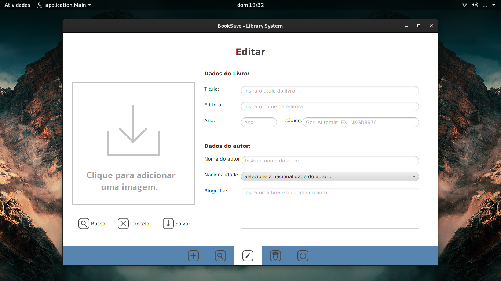
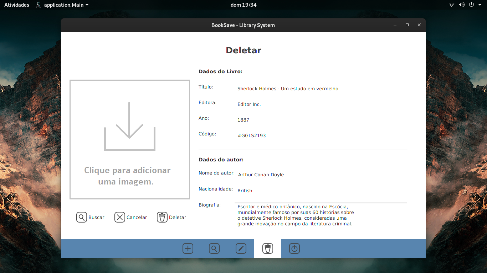

<h1> 📚 BooksSave</h1>

 ♨️ Um sistema simples para cadastro de livros em um DataBase;

<h4> 🚧 em construção 😅 🚧

<h4> 🎯 Objetivos:  </h4>

- [x] Cadastro de livros e respectivos autores
- [x] Atualização de cadastros
- [x] Exclusão de cadastros
- [x] Listagem de(do) cadastro(s)

### 🛠️ Tecnologias

- [OpenJdk](https://openjdk.java.net/)
- [Java](https://www.oracle.com/java/technologies/)
- [MySQL](https://www.mysql.com/)
- [JavaFX](https://openjfx.io/)

Esse projeto é apenas um projeto fictício, onde o objetivo maior é por em prática o conhecimento sobre 
  Java, usando Javafx na construção da interface Gráfica, Jdbc para conexão com o database Mysql. 

### 📷 Algumas Screenshots:
  
  <h4> 🏠 Início:</h4>
  
  
  <h4> ➕ Cadastro:</h4>
  
  
  <h4> 🔎 Pesquisar:</h4>
  
  
  <h4> 📄 Detalhes:</h4>
  
  
  <h4> 📝 Editar:</h4>
  
  
  <h4> ✖️ Deletar:</h4>
  
  
